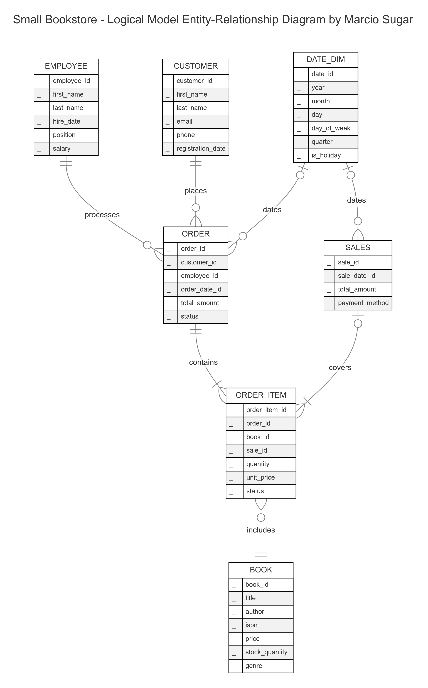
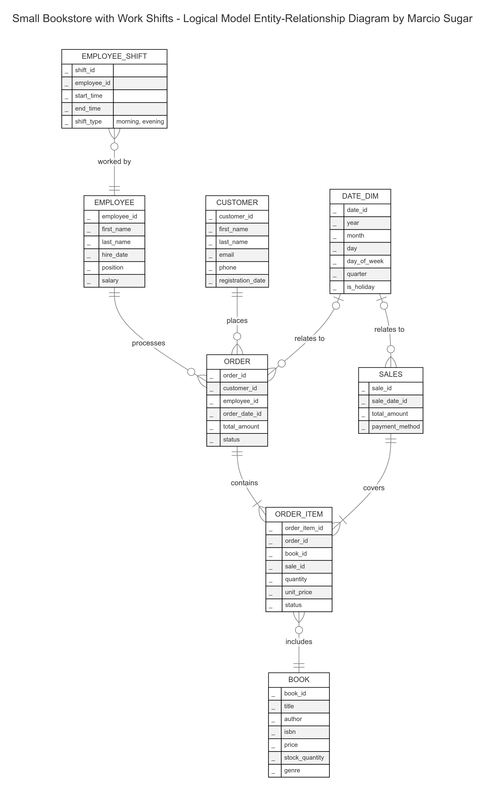
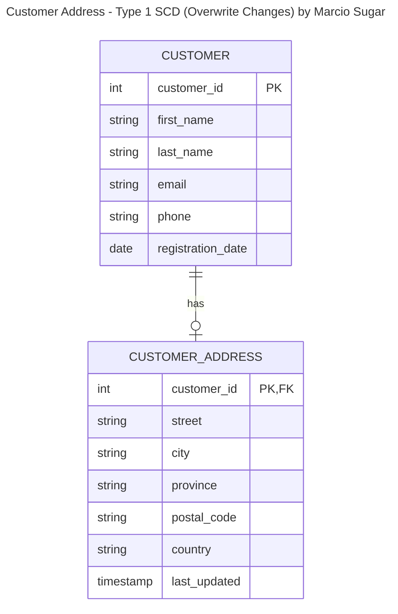
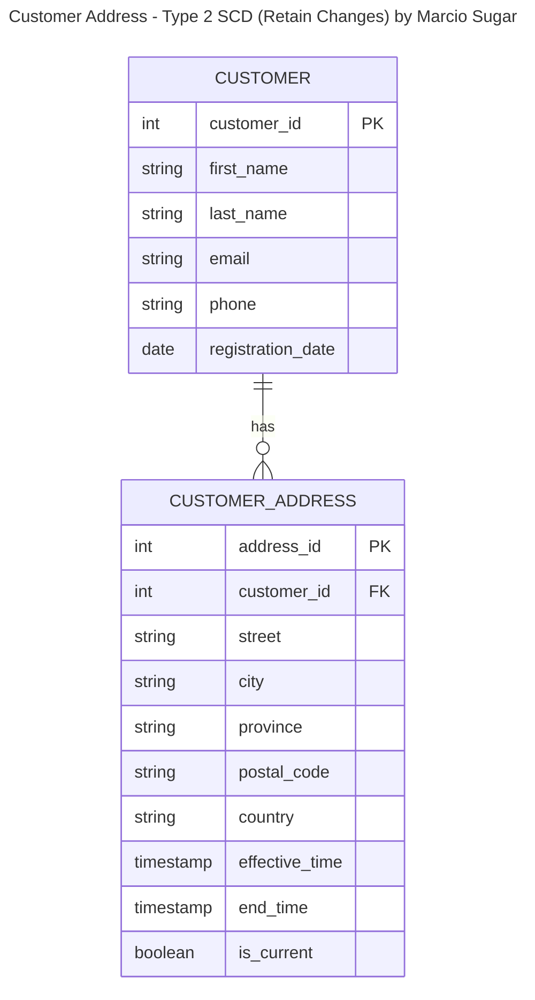

# Assignment 1: Design a Logical Model

## Question 1
Create a logical model for a small bookstore. 📚

At the minimum it should have employee, order, sales, customer, and book entities (tables). Determine sensible column and table design based on what you know about these concepts. Keep it simple, but work out sensible relationships to keep tables reasonably sized. Include a date table. There are several tools online you can use, I'd recommend [_Draw.io_](https://www.drawio.com/) or [_LucidChart_](https://www.lucidchart.com/pages/).

### Logical Model for a Small Bookstore

#### Entity-Relationship Diagram

## Question 2
We want to create employee shifts, splitting up the day into morning and evening. Add this to the ERD.

## Question 3
The store wants to keep customer addresses. Propose two architectures for the CUSTOMER_ADDRESS table, one that will retain changes, and another that will overwrite. Which is type 1, which is type 2?

_Hint, search type 1 vs type 2 slowly changing dimensions._

Bonus: Are there privacy implications to this, why or why not?

> Your answer...

Here are two different architectures for the `CUSTOMER_ADDRESS` table, one that overwrites changes (Type 1 Slowly Changing Dimension) and another that retains changes (Type 2 Slowly Changing Dimension).

### Customer Address - Type 1 SCD (Overwrite Changes)

This design simply overwrites the old address information with the new information when a change occurs. It always reflects the most current information. Historical data is not preserved; once updated, the previous address is lost.

When an address changes, you simply UPDATE the existing record. The last_updated timestamp helps track when the most recent change occurred.

### Customer Address - Type 2 SCD (Retain Changes)

This design creates a new record for each address change, allowing historical addresses to be retained. 

When an address changes, you INSERT a new record with the new address information, and updates the flag in the previous record. The `effective_date` and `end_date` fields track the validity period of each address. The `is_current` boolean flag helps quickly identify the current address.

### Bonus: Privacy Implications
Yes, there are privacy implications when retaining historical data (Type 2 SCD). For example:

- *Right to be Forgotten*: Completly erasing a customer's data history becomes more involved, making it harder to comply with "right to be forgotten" requests.
- *Data Security*: More data stored, larger attack surface when data is exposed.
- *Consent and Transparency*: A customer should be allowed to know what address information is kept, how long, or whether or not historical data is kept.

## Question 4
Review the AdventureWorks Schema [here](https://imgur.com/a/u0m8fX6)

Highlight at least two differences between it and your ERD. Would you change anything in yours?

> Your answer...

### Comparison with AdventureWorks

After examining the AdventureWorks schema, here are two key differences compared to my Small Bookstore ERD:

1. Product Hierarchy and Categories:
   - AdventureWorks: Uses a complex product hierarchy with `ProductCategory`, `ProductSubcategory`, and `Product` tables.
   - My ERD: Has a single `BOOK` table without categories or subcategories tables.

   *Reflection:* The AdventureWorks approach allows for more detailed product organization and easier category-based querying. For a bookstore, implementing a category system (e.g., genre, subject) could improve product organization and search capabilities.

2. Widespread Inclusion of `ModifiedDate` Fields:
   - AdventureWorks: Most entities have a `ModifiedDate` field that allows the system to track when each record was last modified (most likely with milliseconds or higher precision).
   - My ERD: Doesn't have an equivalent field.

   *Reflection:* The AdventureWorks model allows the system to track when each record was last modified. This can be used in a number of different ways including the following:
   - Data integrity and auditing
   - Performance optimization
   - Replication and synchronization
   - Reporting and analytics

   Even a small bookstore could benefit from such a thoughtful approach to database design.

# Criteria

[Assignment Rubric](./assignment_rubric.md)

# Submission Information

🚨 **Please review our [Assignment Submission Guide](https://github.com/UofT-DSI/onboarding/blob/main/onboarding_documents/submissions.md)** 🚨 for detailed instructions on how to format, branch, and submit your work. Following these guidelines is crucial for your submissions to be evaluated correctly.

### Submission Parameters:
* Submission Due Date: `September 28, 2024`
* The branch name for your repo should be: `model-design`
* What to submit for this assignment:
    * This markdown (design_a_logical_model.md) should be populated.
    * Two Entity-Relationship Diagrams (preferably in a pdf, jpeg, png format).
* What the pull request link should look like for this assignment: `https://github.com/<your_github_username>/sql/pull/<pr_id>`
    * Open a private window in your browser. Copy and paste the link to your pull request into the address bar. Make sure you can see your pull request properly. This helps the technical facilitator and learning support staff review your submission easily.

Checklist:
- [x] Create a branch called `model-design`.
- [x] Ensure that the repository is public.
- [x] Review [the PR description guidelines](https://github.com/UofT-DSI/onboarding/blob/main/onboarding_documents/submissions.md#guidelines-for-pull-request-descriptions) and adhere to them.
- [x] Verify that the link is accessible in a private browser window.

If you encounter any difficulties or have questions, please don't hesitate to reach out to our team via our Slack at `#cohort-4-help`. Our Technical Facilitators and Learning Support staff are here to help you navigate any challenges.
